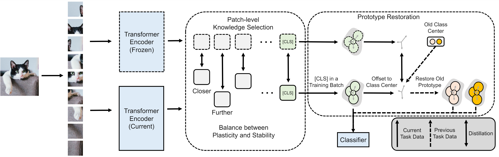

# ViT-CIL - Official PyTorch Implementation


### [AAAI 2024] Fine-Grained Knowledge Selection and Restoration for Non-exemplar Class Incremental Learning

## Usage

* Training on CIFAR-100 dataset:

```
$ python main.py
```

## Environment

* Dependency libraries are listed in requirements.txt.

```
$ pip install -r requirements.txt
```

## Citation
If you use this code for your research, please consider citing:

```
@inproceedings{zhai2024fine,
  title={Fine-Grained Knowledge Selection and Restoration for Non-exemplar Class Incremental Learning},
  author={Zhai, Jiang-Tian and Liu, Xialei and Yu, Lu and Cheng, Ming-Ming},
  booktitle={Proceedings of the AAAI Conference on Artificial Intelligence},
  volume={38},
  number={7},
  pages={6971--6978},
  year={2024}
}
```
